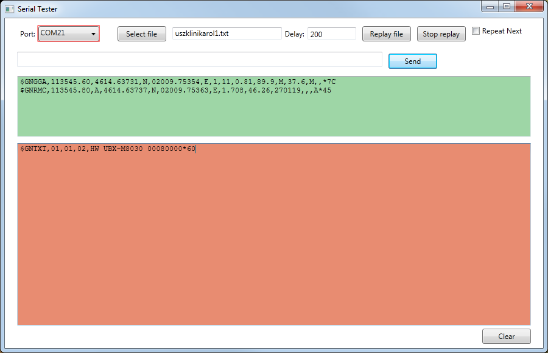

# SerialTester
c# tool for testing serial devices and replaying logs

Used for automated serial monitor connection providing GPS NMEA mock log replay, but can be used for any serial device.

## Current Functionalities

* port can be selected
* can send a line manually
* can display outgoing packet data in textarea and incoming  data
* log file can be selected
* can replay a log/txt at 2 lines packages with a specified delay betwean those 2 lines
* can repeat next package forever (to mock a specific location from the NMEA log)
* replay can be stopped
* textareas can be cleared

## TODO

* baud rate selector (9600 baud hardcoded)
* configuration for package row count (2 lines/package hardcoded)
* better support for multiple lines input/output

## Screenshot

